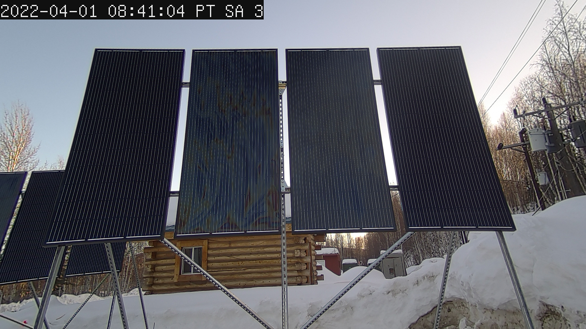
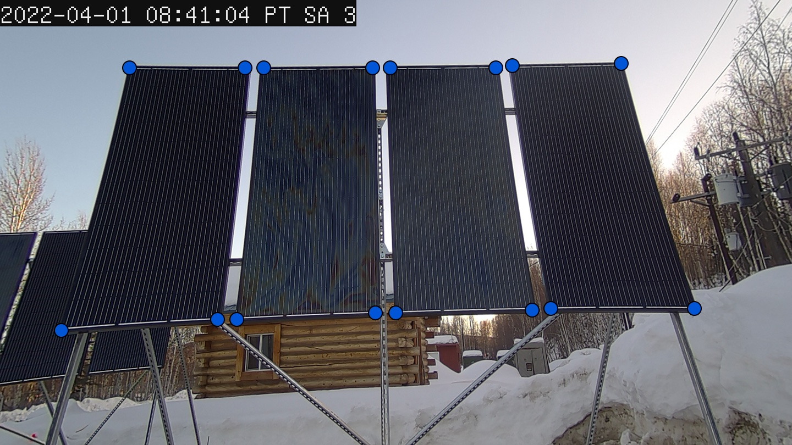
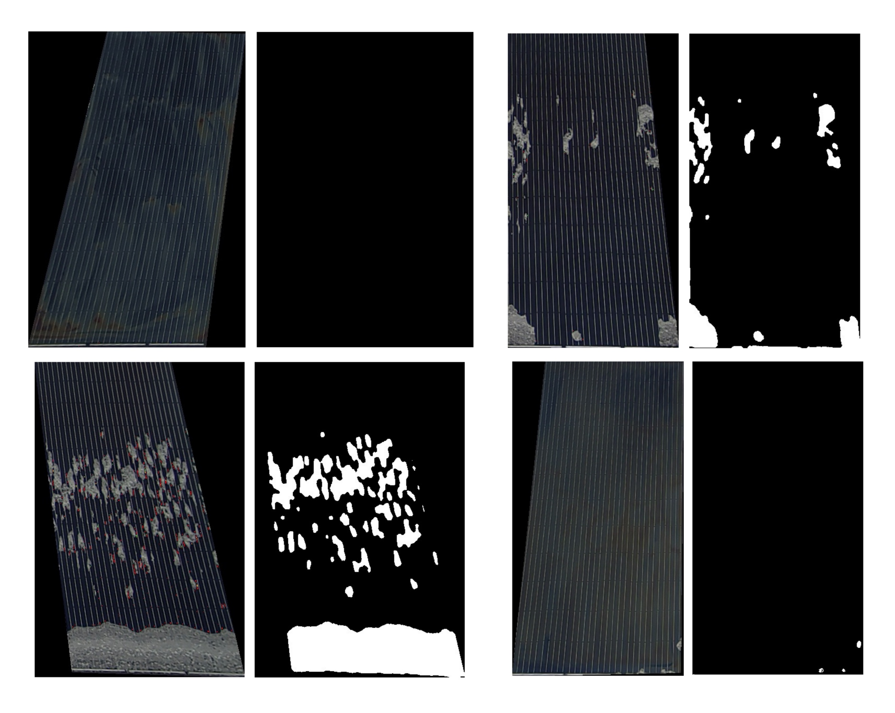
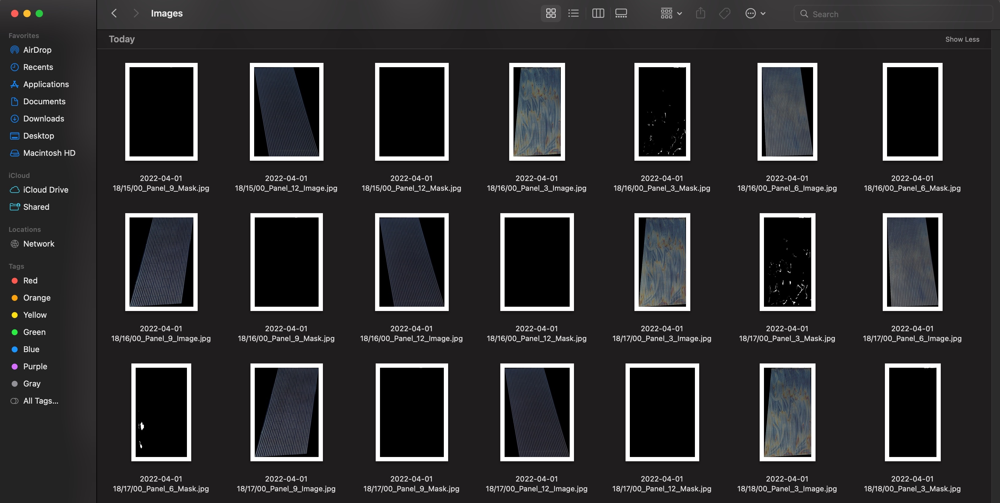

<link rel="stylesheet" href="styles.css" type="text/css">
<link rel="stylesheet" href="academicicons/css/academicons.min.css"/>

# Overview
The goal of this project is to develop a workflow which extracts high quality snow cover data from time-lapse videos of solar panels.
This project has undergone many iterations and approaches. Initially we had devised an algorithm which extracted snow cover data using only computer vision techniques, like [Otsu Binary Thresholding](https://docs.opencv.org/4.x/d7/d4d/tutorial_py_thresholding.html), [HSV Color Thresholding](https://docs.opencv.org/3.4/da/d97/tutorial_threshold_inRange.html), and [various filtering methods](https://docs.opencv.org/3.4/d4/d13/tutorial_py_filtering.html). As you'll see this algorithm did no produce snow cover data with high enough quality and these initial measurements were too susceptible to noise from glare and varying lighting conditions even after applying several noise reduction, and outlier detection techniques like Kernel Density Smoothing and [Isolation Forest](https://scikit-learn.org/stable/modules/generated/sklearn.ensemble.IsolationForest.html). This initial algorithm was however incredibly effective as a machine assisted labeling tool to quickly create training data for the deep learning segmentation model which was eventually used. 7,000+ high quality training pairs were created using the initial computer vision algorithm. This training data was used to train a [ResNet50](https://arxiv.org/pdf/1512.03385.pdf)-[Linknet](https://arxiv.org/pdf/1707.03718.pdf) segmentation model. The model can accurately segment the snow from each panel giving us high quality, low noise snow cover data.  

# Methods

## Localizing the Solar Panels
With the current camera and solar panel setup, throughout the time-lapse videos the position of the solar panels in the frame changes over time. We discussed ways in which we could adjust the design of the experiment to allow the retrieval of the data without moving the camera.

To address this the current setup, has two of the three legs which support the camera attached to the frame of the solar panel array. This should have the effect of moving both the camera and panel array together, keeping the panel array in the same spot of the frame. 

Generally we observed that within each video a single mask can be used to localize the solar panels. Our solution, which is employed in both the Computer Vision Algorithm and the Segmentation Model Algorithm is to display the first frame of each video, and have the user manually input the location of the solar panels. 

Eventually I know we might be able to use this method to create training data for a landmark detection or [object detection](https://github.com/ultralytics/yolov5) algorithm. 

## Time Stamp Extraction
Unfortunately, metadata from the videos did not contain any real-time clock information. Therefore the only way to extract the timestamps was from the video itself. To do so we used the [EasyOCR python library](https://pypi.org/project/easyocr/). The first two timestamps of every video were cropped, resized, and padded then [dilation, erosion](https://docs.opencv.org/3.4/db/df6/tutorial_erosion_dilatation.htmls), and median filters were applied. The preprocessed timestamp images were then run through the EasyOCR engine and converted to datetime objects. Subtracting them we can compute the time step automatically. With the time step and initial timestamp computed the rest can be found by addition. This method allows our technicians to change the time step without having to adjust anything in the software. 

## Machine Assisted Labeling
### Computer Vision Algorithm
With the panels localized, and timestamps extracted we can finally move on to the image processing. As what was previously discussed the initial algorithm relied entirely on computer vision techniques. 
The following is a generalized recipe for the algorithm. 

- Take a small sample of the sky and compute the mean intensity from this sample. 
- Crop out the solar panel
- Apply user generated mask
- Apply median blur (night time dots from up lighting)
- Apply bilateral filter (remove daytime vertical lines from down lighting)
- Compute HSV Threshold, range is dependent on sample intensity
- Compute Otsu Threshold value (A custom function was written which counts the number of black border pixels, and removes them before the Otsu Threshold is calculated)
  - Mean window with a kernel size of 6 frames was used to impute any outlier thresholds that exceed half a standard deviation. 
  
- [Normalized Root Mean Squared Error](https://scikit-image.org/docs/stable/api/skimage.metrics.html#skimage.metrics.normalized_root_mse) is computed between the two segmentation methods (HSV and Otsu). This method computes dissimilarity between the two segmentation methods on a scale from 0 to 1. When the value is 1 the resultant segmentation are completely dissimilar. 
  - If the score is greater than or equal .90, we compute the snow cover percentage for both segmentation methods and compare them to a the mean snow cover over the last 5 frames. We use which ever segmentation results in a snow cover reading that is closer to the mean. 

This method had several issues. In the transitions between day and night we see the color balance of the camera change, which causes huge issues with the HSV thresholding. This method also cannot account for glare, so any time the panels are in direct sunlight with no snow on the panel it will register any reflections as snow. Below is an example of what happens when the panels are in direct sunlight. 

Beyond the image processing, the script which contains this algorithm also does all the data collation to compile the snow cover data into a single .csv file. It can also generate a debugging video, for quickly scrubbing through and finding the timestamps where the algorithm did a poor job at extracting data. 

### Cleaning Training Data
Clearly this method had a lot of issues to overcome, so we pivoted to a deep learning approach. Luckily the computer vision algorithm was still incredibly useful as a machine assisted labeling tool for generating the training data that is needed for our deep learning model. Running the original computer vision algorithm again, but saving the masked version of the initial crop and the final segmentation we get the following training data. 

Since each frame computes 4 different training pairs, at a time step of frame per minute we can approximate that a single time lapse video which lasts a period of 24 hours will generate a total of 5,760 training pairs. 

$$ \frac{4\text{ Training Pairs}}{1 \text{ Frame}}*\frac{1 \text{ Frame}}{1 \text{ Minute}}*\frac{60 \text{ Minutes}}{1 \text{ Hour}}*\frac{24 \text{ Hours}}{1 \text{ Time Lapse}} = \frac{5,760\text{ Training Pairs}}{1 \text{ Time Lapse}}$$ 

We found that the fastest way to scrub through the data was to use the Mac OS finder or Adobe Bridge to display a grid of training pairs. Here is an example of how one might format the finder, or Adobe Bridge widow to scrub the images

To scrub the images we simply deleted the pairs that exhibited noise. The following an example of a training pair which the computer vision algorithm chose HSV thresholding, and the coatings on this particular panel reflect a color that is being confused for snow. 

Large sections of training images that were exposed to direct glare were instead blacked out, so as to train the segmentation network to ignore direct sunlight. In the future we think it would be even better to encode these images into a separate class and train the network to detect the presence of glare as well as snow, instead of just ignoring it. 

## Deep Learning Segmentation Model

Using only two videos, we were able to generate 7,000+ high quality training pairs with instances of high snow cover and glare in a matter of hours. With the training data generated we used the [Segmentation Models python library](https://github.com/qubvel/segmentation_models) to easily test different network architectures and backbones. As an aside, generally we refer to a network backbone as the encoder or feature extractor. This is the section of the network that is compressing the images, using the loss function and back-propagation to guide which features get extracted from the image. The network architecture, at least in this context, defines how the layers of the network are connected. Consider the difference between a U-net architecture and a Link-net architecture. 

We can see that in the U-net, layers from the encoder or backbone are concatenated with the layers from the decoder. In the Link-net those same layers are added instead. This generally has the effect of reducing the number of parameters in the model, while maintaining performance. 

For our model we used a ResNet50 backbone and a Linknet architecture, below is a high level sketch of what it looks like. 

The model was trained using a combination of the [binary focal](https://arxiv.org/pdf/1708.02002.pdf) and the [dice loss](https://arxiv.org/pdf/2006.14822.pdf) functions. The dice loss function optimizes a similar metric to IoU. The binary focal loss function allows us to weigh certain classes that we might feel are underrepresented in the data, using a hyper parameter $\gamma$. In our model, both the non-snow and snow classes were weighted evenly, but this will also allow us to add a glare class later on, which will likely be underrepresented in our data. Let $p_t$ be the predicted probability for a pixel in class $t$, and let $y$ be the true value (0 or 1). 

$$Loss(y, p_t) = FL(p_t) + DL(y + p_t)$$
$$Loss(y, p_t) = -(1 - p_t)^{\gamma}log(p_t) + 1 - \frac{2yp_t + 1}{2y + p_t + 1}$$

# Results
The performance of segmentation models is usually measured with a metric called IOU, or intersection over union. Basically we divide the intersection between our true and predicted mask, and divide that by the sum or union of both masks. Below is an graphic which illustrates this idea. 

On the IoU metric our model achieved a final value of .8986. Thanks to the segmentation models library we were able to take advantage of pre-trained weights trained on the ImageNet dataset. Because of this from the first epoch our model achieved an IoU score of .8749.

We can get a better sense of the performance of our model by plotting the snow cover percentage over time. Here we can see that the segmentation model is more robust to direct sunlight, and changes in lighting conditions. 

# Conclusions
There are still several things we can do to improve the performance of the segmentation model, and the user experience for our technicians. For example, developing an object or landmark detection model for localizing the solar panels, parallelizing the image processing step to increase performance, and retraining the segmentation model to include glare as a third class. Outside of the software realm, changing the camera settings so that white balance is set to a constant value, instead of auto will make it easier for the computer vision algorithm to generate pairs and it will improve our segmentation model's accuracy. Currently we cannot support a time step that is smaller than one minute, and with the current solar panel localization approach, increasing the time step to multiple days or even hours might cause the masks to become misaligned. 

