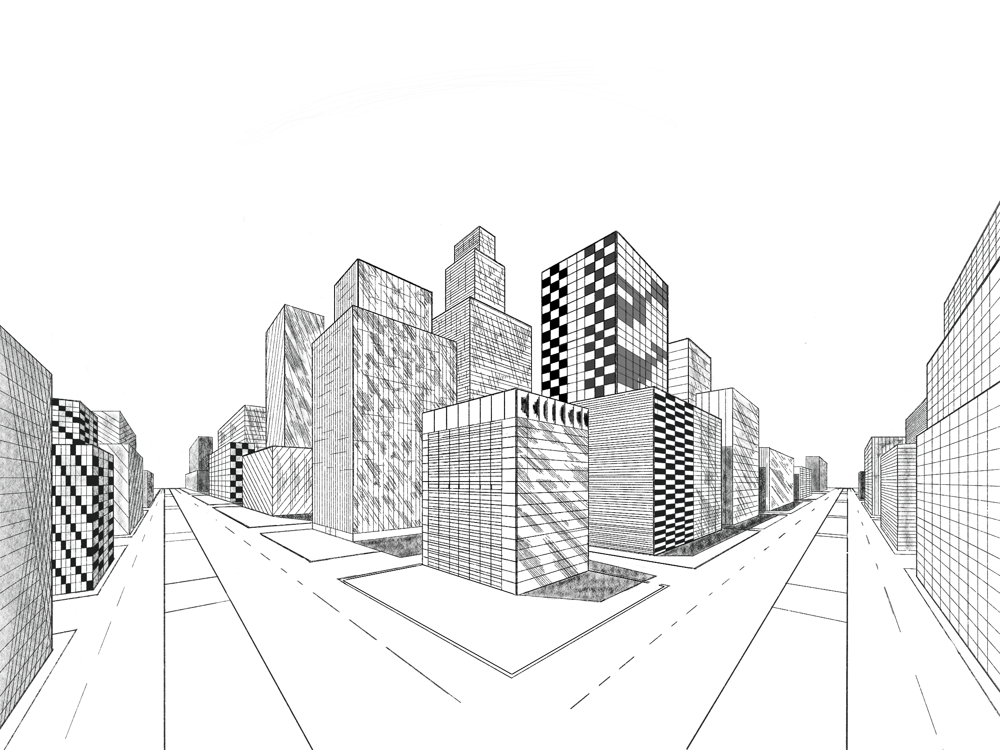

<link rel="stylesheet" href="styles.css" type="text/css">
<link rel="stylesheet" href="academicicons/css/academicons.min.css"/>

# Welcome to my Course Work REPO

This repository is dedicated to presenting my techincal course work as a mathematics student at UAF.
*Note: Many courses did not require latex or any sort of programming so they will not be represented *

 

## Courses
[STAT 401 Regression and Analysis of Variance](https://github.com/StefanoFochesatto/STAT-401)

Topics include a variety of regression techniques, Type I and Type II sums of squares, indicator variables, and model selection techniques. Analysis of variance and covariance for multifactor studies in completely randomized and randomized complete block designs, multiple comparisons, and orthogonal contrasts.

[STAT 402 Scientific Sampling](https://github.com/StefanoFochesatto/STAT-402)

Topics include sampling methods, including simple random, stratified and systematic; estimation procedures, including ratio and regression methods; special area and point sampling procedures; optimum allocation. The course included three group projects centered around estimating a paramater. My favorite project was the third [sampling project](https://github.com/StefanoFochesatto/STAT-402/blob/main/Coursework/Sampling%20Project%20%233/Project3Final.pdf), where we had to estimate the total number of pages in the QZ section of the Rasmussen Library. Although the stratified, systematic estimator we used was far from exotic the project was a fun hands on application of what we learned throughout the course. 
 
 [MATH 614 Numerical Linear Algebra](https://github.com/StefanoFochesatto/MATH-614)
 
This course included topics on algorithms and theory for stable and accurate computation using matrices and vectors on computers. Matrix factorizations, direct and iterative methods for solving linear systems, least squares, eigenvalue and singular value decompositions. Practical implementation and application of algorithms. My favorite topic of the course came from our discussion of the google PageRank algorithm in [homework 9](https://github.com/StefanoFochesatto/MATH-614/blob/main/Coursework/Homework%20%239/Homework%20%239.pdf). 
 
 [BIOL 497 Machine Learning](https://github.com/StefanoFochesatto/BIOL-497)
 
This direct study taught the foundations and the applications of machine learning and it's software in the
Data Sciences, primarily finding signals in data, inference from predictions, workflows, and
database applications using ‘cloud-based’ methods. The course came about as a series of lectures with three labs and one final project. The first two labs involved developing workflows for ML models using Salford Predictive Modeler. [The third lab](https://github.com/StefanoFochesatto/BIOL-497/blob/main/Coursework/Exploring%20Cloud%20Databases%20Lab.pdf) was an exploration on cloud database management services, we built a dashboard with three different backends (AWS, Google Cloud Platform, and Microsoft Azure). [The final project](https://github.com/StefanoFochesatto/BIOL-497/blob/main/Coursework/Final%20Project%20Files/ML_Final%20Project.pdf) involved modeling the population of Rock Ptarmigan in Iceland using GIS data.

 
 
 [MATH 316 History and Philosophy of Mathematics](https://github.com/StefanoFochesatto/MATH-316)
 
This course provided an introduction to several important periods in the history of mathematics, including mathematics of Ancient Babylon, Mesopotamia, Greece, China and India, medieval Europe, the Middle East and the Renaissance; the development of geometry, algebra and calculus. The course demanded several presentations throughout the semester, my two favorate were on the topic of [Florence Nightingale diagrams](https://github.com/StefanoFochesatto/MATH-316/blob/main/Florence%20Nightingale%20Presentation.pdf), and the [history of approximating methods for pi](https://github.com/StefanoFochesatto/MATH-316/blob/main/Approximation%20Pi%20Presentation.pdf). My Florence Nightingale presentation culminated in a [simple dashboard demo](https://github.com/StefanoFochesatto/MATH-316/blob/main/Data%20Dashboard%20Demo.ipynb) built using plotly express and dash. My final presentation on the approximation of pi incorported a [convergence analysis of several 17th century methods using matlab](https://github.com/StefanoFochesatto/MATH-316/tree/main/Final%20Presentation%20Convergence%20Analysis), as well as the classic [Monte Carlo method for approximating pi.](https://github.com/StefanoFochesatto/MATH-316/tree/main/Final%20Presentation%20Monte%20Carlo%20Demo)  
 
 [MATH 401 Real Analysis](https://github.com/StefanoFochesatto/MATH-401)
 
Topics include completeness of the real numbers and its consequence, convergence of sequences and series, limits and continuity, differentiation, the Riemann integral.

 
 [MATH 426 Numerical Analysis](https://github.com/StefanoFochesatto/MATH-426)
 
This class provided a great introduction to 
Numerical methods and Matlab. Topics include
 direct and iterative solutions of systems of equations, interpolation, numerical differentiation and integration, numerical solutions of ordinary differential equations, 
and error analysis. One of my favorite sections in this course came at the end where we compared different methods of quadrature [(Clenshaw-Curtis vs Gauss-Legendre)](https://github.com/StefanoFochesatto/MATH-426/blob/main/Coursework/WH%2313/StefanoFochesatto%20-%20HW13.pdf).
Learning about Clenshaw-Curtis quadrature was the main inspiration for my final statistics [project](https://github.com/StefanoFochesatto/STAT-300/).

 
 [STAT 300 Statistics](https://github.com/StefanoFochesatto/STAT-300)
 
This course provided an introduction to concepts and applications of elementary statistical method. Topics include sampling and data analysis, descriptive statistics, elementary probability, probability and sampling distributions, confidence intervals, hypothesis testing, correlation, and simple linear regression.
My [final project](https://github.com/StefanoFochesatto/STAT-300/blob/main/Coursework/StatsProject/Project.pdf) explored how using Chebyschev interpolation points as sampling points might affect the statistical accuracy of a simple linear regression. 

 
 [MATH 490 Senior Seminar: Graph Theory](https://github.com/StefanoFochesatto/MATH-490)
 
Senior Seminar is the capstone experience for UAF’s undergraduate mathematics program. This course was 
primarily structured around student led lectures on Graph Theory. The final project was a rigourous presentation
on an open problem in mathematics. My presentation was on [variations of the art gallery problem](https://github.com/StefanoFochesatto/MATH-490/blob/main/Coursework/Final%20Presentation/Final_Presentation.pdf).
 
 [MATH 305 Geometry](https://github.com/StefanoFochesatto/MATH-305)
 
This course provided an introduction to many topics in geometry, culminating in a fun and artistic final project.
Topics include Euclidean and non-Euclidean plane geometry, affine geometry, projective geometry, and topology.

                                              

 
 
 [MATH 314 Linear Algebra](https://github.com/StefanoFochesatto/MATH-314)
 
This course provided a primer for the basics of Linear Algebra. Topics include linear equations, finite dimensional vector spaces, matrices, determinants, linear transformations, characteristic values and inner product spaces.
 
 [MATH 371 Probability](https://github.com/StefanoFochesatto/MATH-371)
 
This course supplied a general introduction to probability. Topics included probability spaces, conditional probability, random variables, continuous and discrete distributions, expectation, moments, moment generating functions and characteristic functions. Above you will find two of the three labs that were completed throughout this course. 
 
 [MATH 320 Combinatorics](https://github.com/StefanoFochesatto/MATH-320)
 
This course provided a basis for combinatorial proof techniques and methods.  Topics include enumerative combinatorics, generating functions, set systems, recurrence relations,
directed graphs, matchings, Hamiltonian and Eulerian graphs, and Ramsey Theory.

 
 [CS 201 Computer Science I](https://github.com/StefanoFochesatto/CS-201)
 
This course provided a broad overview of basic programing structures and best practices. Topics included 
algorithm development, structured programming, top-down design, good programming style, object-oriented programming and elementary data structures.
The course concluded in a group project where we constructed a terminal based calculator with various features such as, a token based interpreter, elementary root 
finding methods, and various combinatorial functions(Bell, Stirling, Combination, Permutation, K-list) with support for variable presicion arithmetic through the [GMP library](https://gmplib.org/).

