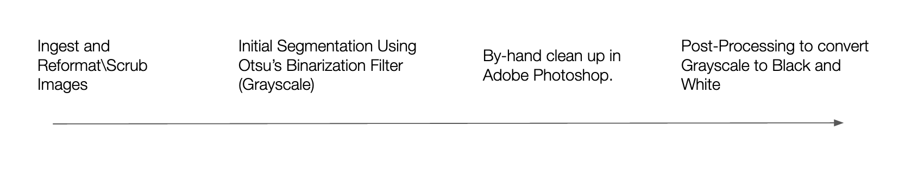
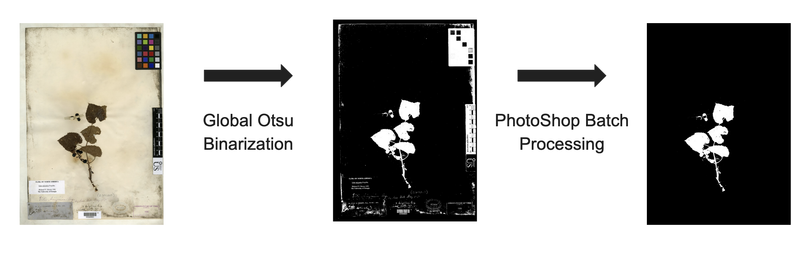
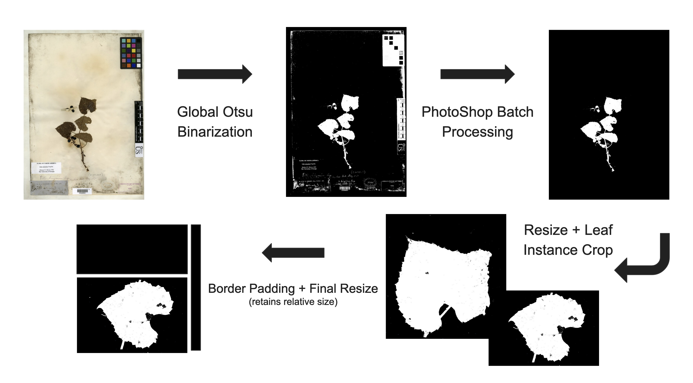

<link rel="stylesheet" href="styles.css" type="text/css">
<link rel="stylesheet" href="academicicons/css/academicons.min.css"/>


## Introduction
 The goal of this research is to use machine learning to capture and quantify the morphological variation inherent in the ~ 370 herbarium specimen images from several herbaria with large Vitis arizonica complex collections (ASU, RSA, and US). Specifically we will be applying a convolutional variational autoencoder to compress these images into a latent space where a further cluster analysis might reveal biological insights that could aid in further species delimitation. Ultimately, these insights could help in an explicit statistical framework for morphological variation, aiding in delineating species by integrating morphological and phylogeny data. 


## Building the Segmentation Masks
Before we are able to start working on training a model to cluster the images we need to remove any biasing information from the images. This involves creating something called a segmentation mask, which will essentially remove any biasing information involved in capturing the herbarium sheet samples. The way that the mask works is we will create a black and white image, where there is no presence of the plant sample we will color the image black and where there is we will color the image white. 

In terms of biasing information think, camera settings, or any identifying labels. Ideally we want the segmentation mask to still capture all the information that a paleo-botanist would use when delineating species. I'm told that most of the time this information if found almost entirely in the morphology of the leaves. 

We will be using a workflow described in the following [article](https://www.ncbi.nlm.nih.gov/pmc/articles/PMC7328659/) by Alexander White, Rebecca Dikow, et.al, 
Their article describes training a neural network to be able to recreate segmentation masks for fern shaped herbarium sheets. To accomplish this tasks they had to develop a workflow for creating several 'ground truth' masks. This is the part of their research that we will be taking advantage of. Currently this workflow involves a good amount of editing by hand if in the later stages of our research, we decide that more data is needed we might spend time training a neural network to create these masks for us.

Mapping out the workflow for building the segmentation masks, consider the following,



## Reformatting Images
Some of the Herbarium Sheets were received and stored in the .tiff file format. In order to save space and have our data in one file format we will be converting them to .jpg. 


```{python eval = FALSE}
import os
from PIL import Image

# Assuming the current directory has the images. 
yourpath = os.getcwd()
# Extracting file names in current directory. 
for root, dirs, files in os.walk(yourpath, topdown=False):
  # Looping through filenames
  for name in files:
    print(os.path.join(root, name))
      
    # If file ends in tif, check to see if it's already converted.
    if os.path.splitext(os.path.join(root, name))[1].lower() == ".tif":
      if os.path.isfile(os.path.splitext(os.path.join(root, name))[0] + ".jpg"):
        print("A jpeg file already exists for %s" % name)
          # If a jpeg is *NOT* present, create one from the tiff.
      else:
        outfile = os.path.splitext(os.path.join(root, name))[0] + ".jpg"
        try:
          im = Image.open(os.path.join(root, name))
          print("Generating jpeg for %s" % name)
          im.thumbnail(im.size)
          im.save(outfile, "JPEG", quality=100)
        except e:
          print(e)
```
## Pre Processing

The code for the initial segmentation used in the article by Alexander White, Rebecca Dikow, et al. can be found [here](https://github.com/sidatasciencelab/fern_segmentation/blob/master/segmentation_code.ipynb). This initial code relies on an a python wrapper for OpenCV(Computer Vision) called cv2. The code simply performs Otsu binarization method to create an initial mask. 


### Otsu Binarization Method

The ostsu binarization method finds a threshold for making the mask, which minimized the intra-class variance(variance between the two black and white classes.) Here is an example of how it works. First we take the grayscale image then create a frequency histogram of it's pixel intensity values(1-255). We scan through this frequency histogram, everything to the left of our scan is put into one class everything to the right of our scan is put into another class. At each iteration we compute a cost function which is a weighted sum of the variances in each class, 

$$\sigma^2_w(t) = w_1(t)\sigma^2_1(t) + w_2(t)\sigma^2_2(t).$$
$$w_1(t) = \sum_{i = 1}^{t - 1}p(i)$$
$$w_2(t) = \sum_{i = t}^{255}p(i)$$

Since there are only two classes, namely black and white we know that the threshold which minimizes intra-class variance, must also maximize inter-class variance. Which is computed with the following, 

$$ \sigma^2_b(t) = w_1(t)w_2(t)\left(\mu_1(t)- \mu_2(t)\right)^2.$$

Here is some python code for computing the Otsu Binarization threshold. 
```{python eval = FALSE}
import cv2 #openCV for image processing
import numpy as np

## Area for Otsu Binarization Demo
orig = cv2.imread("example.jpg", cv2.IMREAD_GRAYSCALE)
### Generating the greyscale value histogram
freq = np.zeros(256)
for i in range(len(orig)):
    for j in range(len(orig[0])):
        freq[orig[i,j]] += 1

### Normalizing to get probability dist. 
total = sum(freq)
prob = freq/total

## Applying Otsu binarization algorithm to find the threshold which maximizes inter-class variance, 
inter_variance = np.zeros(255)
for i in range(1,256):
    w_0 = sum(prob[0:i-1]) 
    w_1 = sum(prob[i:255])
    if (w_0 == 0 or w_1 == 0):
        inter_variance[i-1] = 0
    else:
        mu_0 = sum(range(1,256)[1:i-1]*prob[1:i-1])/w_0
        mu_1 = sum(range(1,256)[i:255]*prob[i:255])/w_1
        inter_variance[i-1] = w_0*w_1*(mu_0 - mu_1)**2

## Pulling threshold where inter_variance is maximized
Otsu_Thresh = np.argmax(inter_variance)
print(str('This is the Otsu threshold computed by the novel implemintation: ' + str(Otsu_Thresh)))
```


## Otsu Binarization Demo

```{r, echo = FALSE, out.width='100%'}
library(shiny)
knitr::include_app("https://stefanofochesatto.shinyapps.io/otsudemo/", height = '550px')
```


## Pre Processing 
#### Generating Inital Mask
```{python eval = FALSE}
import cv2 #openCV for image processing
import numpy as np

#### Full Script For Initial segmentation mask 
path = 'YOUR_PATH' ##Supply Full Path to images directory

#### Directory Management
os.chdir(path) #Change the working directory to the image directory

Imagelist = [] #Pull the current list of files in image directory
for file in os.listdir(path):
    if file.endswith(".jpg"): # Herbarium Sheets are in jpg format
        Imagelist.append(file)


## Creating Directory for each mask. 
dir_fore = 'Foreground_Masks'
os.mkdir(os.path.join(path, dir_fore))
dir_back = 'Background_Masks'
os.mkdir(os.path.join(path, dir_back))


for i in Imagelist:
    os.chdir(path) # We have to set the path everytime since cv2 can't handle relative paths without it.
    currentImage = cv2.imread(i, cv2.IMREAD_GRAYSCALE) # Reading in the current image
    
    # Applying the threshold
    threshImage = copy.deepcopy(currentImage)
    ret, thresh = cv2.threshold(threshImage,0,255, cv2.THRESH_BINARY_INV + cv2.THRESH_OTSU)
    
    # Creating the masks
    mask_fore = copy.deepcopy(currentImage)
    mask_fore = np.where((currentImage).astype(np.uint8) > ret, 0, 255)  
    image_fore = Image.fromarray((mask_fore).astype(np.uint8))
    os.chdir(str(path+'/Foreground_Masks'))
    image_fore.save(str(i),"JPEG") 
    
    
    mask_back = copy.deepcopy(currentImage)
    mask_back = np.where((currentImage).astype(np.uint8) > ret, 255, 0) 
    image_back = Image.fromarray((mask_back).astype(np.uint8))
    os.chdir(str(path+'/Background_Masks'))
    image_back.save(str(i),"JPEG")     
```

### Photoshop Batch Processing
From here we take the initial mask and use Photoshop to erase the color bar, placard and bar code information that is left behind. So the workflow so far results in the following segmentation mask. 


### Processing for Cluster Algorithm
Given the large file size of the post-Photoshop segmentation mask, and the fact that they are not instance-segmentation masks it makes more sence to try and cluster the images on a leaf segmentation mask level. To do so some more preproccessing is required to prepare the images. First we resized the large segmentation masks, to about half size. We tested several resizing methods and found that Bit exact nearest neighbor interpolation was able to best retain information about edge morphology, for our dataset. 

A custom script was written iterate through the resized segmentation mask images and crop out instances of high quality leafs to be used for the image clustering (Code to this script will be added to the programming tab). Finally the leaf instance segmentation were padded to retain information about relative size, while normalizing and squaring up the images for the clustering algorithm. 

Here is some example code for resizing the large herbarium specimen, and adding the padding to square up the leaf instance segmentation masks. 

#### Resizing Code:
```{python eval = FALSE}
path = r'ADDPATH TO YOUR FULL SIZED SEGMENTATION MASKS'
os.chdir(path) #Change the working directory to the Segmentation Mask directory
SegmentationMaskList = [] #Pull the current list of files in Segmentation Mask directory
for file in os.listdir(path):
    if file.endswith(".jpg") and not file.startswith('.'): 
        SegmentationMaskList.append(file)

SavePath = os.path.join(path, 'ResizedInterNearExact')
os.mkdir(SavePath)
for i in SegmentationMaskList:
        os.chdir(path) 
        # Read in image with segmentation mask
        img = cv2.imread(i, cv2.IMREAD_GRAYSCALE)
        # Resizing
        scaleFactor = 2000/img.shape[0]
        dim = (int(img.shape[1]*scaleFactor),int(img.shape[0]*scaleFactor))
        resized = cv2.resize(img, dim, interpolation = cv2.INTER_NEAREST_EXACT)
        # Saving
        os.chdir(SavePath) 
        Rename = i[:-4] + '_resized.jpg'
        cv2.imwrite(Rename, resized)

```
#### Padding Code:
```{python eval = FALSE}
path = r'ADDPATH TO YOUR RESIZED SEGMENTATION MASKS'
os.chdir(path) #Change the working directory to the Resized Segmentation Masks Directory
SavePath = os.path.join(path, 'PaddedSquare')
os.mkdir(SavePath)
for i in SegmentationMaskList:
       os.chdir(path) 
       img = cv2.imread(i, cv2.IMREAD_GRAYSCALE)
       old_image_height, old_image_width = img.shape

       result = np.full((896,896), 0, dtype=np.uint8)

       # compute center offset
       x_center = (896 - old_image_width) // 2
       y_center = (896 - old_image_height) // 2

       # copy img image into center of result image
       result[y_center:y_center+old_image_height, 
       x_center:x_center+old_image_width] = img
       os.chdir(SavePath) # We have to set the path every time since cv2 can't handle relative paths without it.
       Rename = i[:-4] + '_Padded.jpg'
       cv2.imwrite(Rename, result)

```
Finally our pre processing pipeline should look like this.


## Deep Embedded Clustering Algorithm


