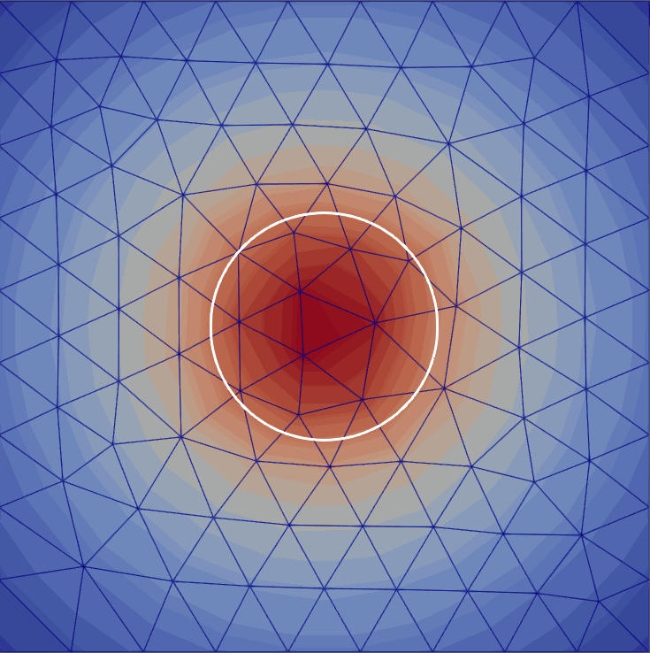
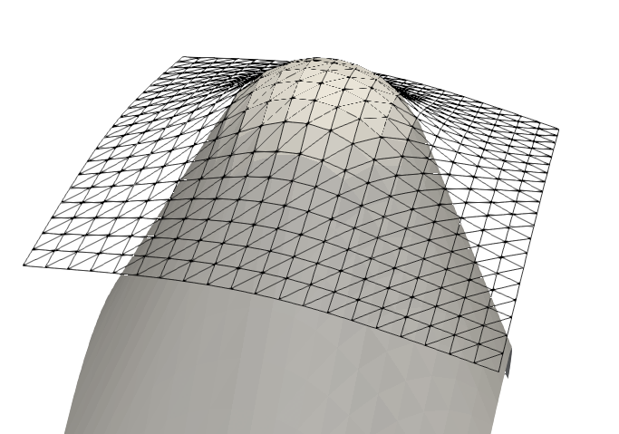
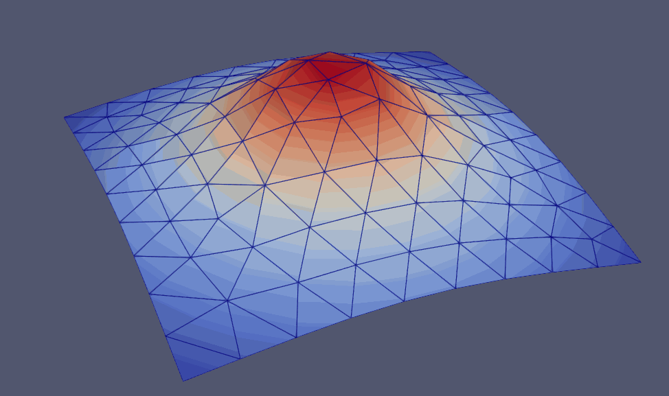
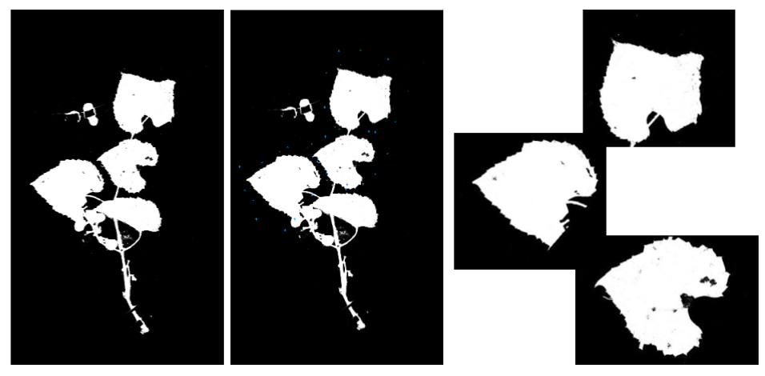
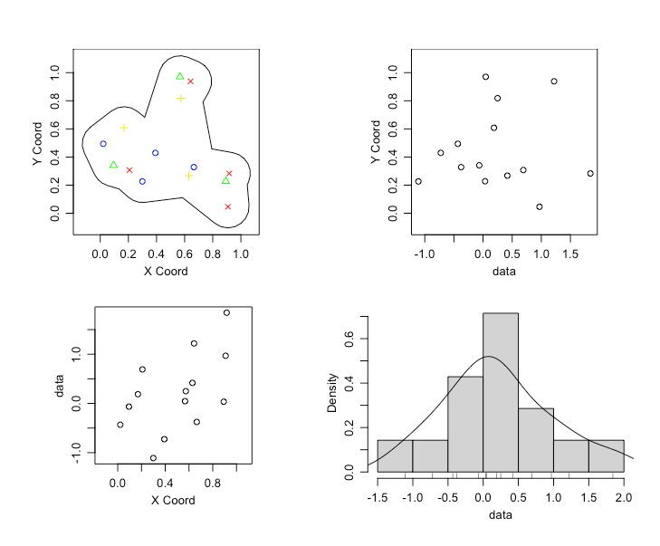
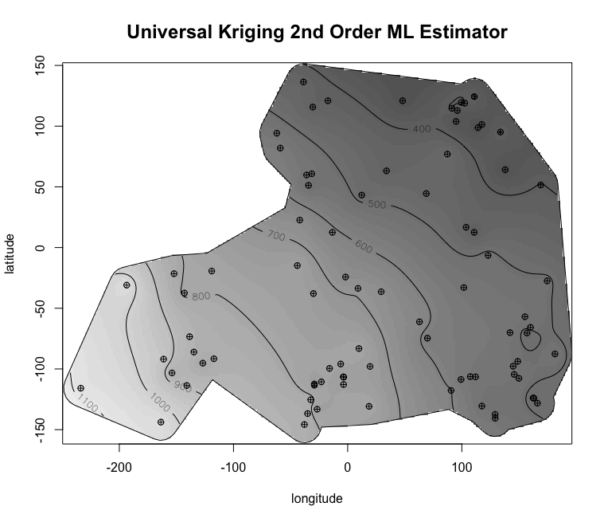

<link rel="stylesheet" href="styles.css" type="text/css">
<link rel="stylesheet" href="academicicons/css/academicons.min.css"/>

```{=html}
<style>
.vertical-video-container img {
    width: auto;
    height: auto; /* Fit GIF vertically */
    max-height: 80vh; /* Adjust as needed */
    border-radius: 8px; /* Optional: rounded corners */
    display: block; /* Ensures no extra space below image */
    margin: 0 auto;
}
</style>
```

### Adaptive Mesh Refinement for Variational Inequalities

The subject of my master's research has been developing methods of adaptive mesh refinement for variational inequalities. The methods we developed were implemented using the Firedrake and Netgen libraries. For more information visit the [repo](https://github.com/StefanoFochesatto/VI-AMR) and check out the paper (coming soon).  

:::::::::::::: {.columns}
::: {.column width="50%"}

:::
::: {.column width="50%"}

                                                

:::
::::::::::::::


---

### Leaf Segmentation Tool
This script is essentially a polygonal cropping tool, but was made to facilitate the preprocessing step of herbarium sheets as outlined during the [presentation at Botony 2022](https://stefanofochesatto.github.io/files/DeepLearningImageClusteringBotany2022.pdf). The script begins by prompting the user for their images directory, then the first image is displayed. The user selects a bounding box with the cursor and the space button is used to crop. Pressing the escape key proceeds to the next image where the user can again crop as desired. 
Below is an example of how the script displays and image, the user then selects bounding boxes in cyan, and the resultant leaf level masks. This tool and further documentation can be found [here](https://github.com/StefanoFochesatto/Leaf-Segmentation-Tool).


                                                
---

### Custom Borders for 'geoR' Package Objects.
The following *get_borders(my.lonlat, concavity_param, frac)* function finds the concave hull of your geoR data object, and generates 
a nice bounding border for your geoR object. 

[*get_borders()*](https://github.com/StefanoFochesatto/Homework-Spring-2022/blob/main/Spatial%20Statistics/get_borders.r)

The function takes three parameters, my.lonlat, concavity_param, and frac. 
The my.lonlat parameter is simply a 2 column matrix of your lon,lat data. The concavity_param argument is a relative measure of concavity. When set to 1 we get a concave hull, for sufficiently large concavity_param we get the convex hull. The frac argument extends the border in every direction. The function uses the geoR, concaveman, and rgeos packages. The following is an example, and results.


```{r, eval=FALSE}
install.packages(c("geoR", "concaveman", "rgeos"))
library(geoR)
library(concaveman)
library(rgeos)

source("get_borders.r") # or copy and paste directly into RStudio

## Generating Data
set.seed(5834)
n <- 14
lons <- runif(n)
lats <- runif(n)
yyy <- rnorm(n)
## Creating geoR object
mygeo <- as.geodata(cbind(lons,lats,yyy))
## Custom Border
mygeo$borders <- get.borders(cbind(lons,lats), concavity_param = 1, frac = .15)

## Plotting
plot(mygeo)

```

:::::::::::::: {.columns}
::: {.column width="50%"}

:::
::: {.column width="50%"}

:::
::::::::::::::


                                              
                                              